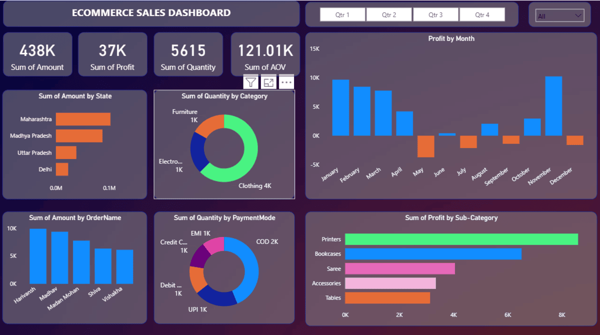

# 🌐 My Portfolio Website

This is my personal portfolio website showcasing my skills, projects, and experience.

## 🚀 Live Demo
[Click here to visit my portfolio]([https://your-portfolio-link.com](https://ashwaninagar46.github.io/)

## 🛠 Tech Stack
- HTML5
- CSS3 / Tailwind CSS / Bootstrap (jo tumne use kiya ho)
- JavaScript (React / Vue / etc., agar use kiya ho)
- Git & GitHub Pages (for deployment)

## 📸 Preview


## 📂 How to Run Locally
1. Clone the repository:
   ```bash
   git clone https://github.com/ashwaninagar/ashwaninagar46.github.io.git
